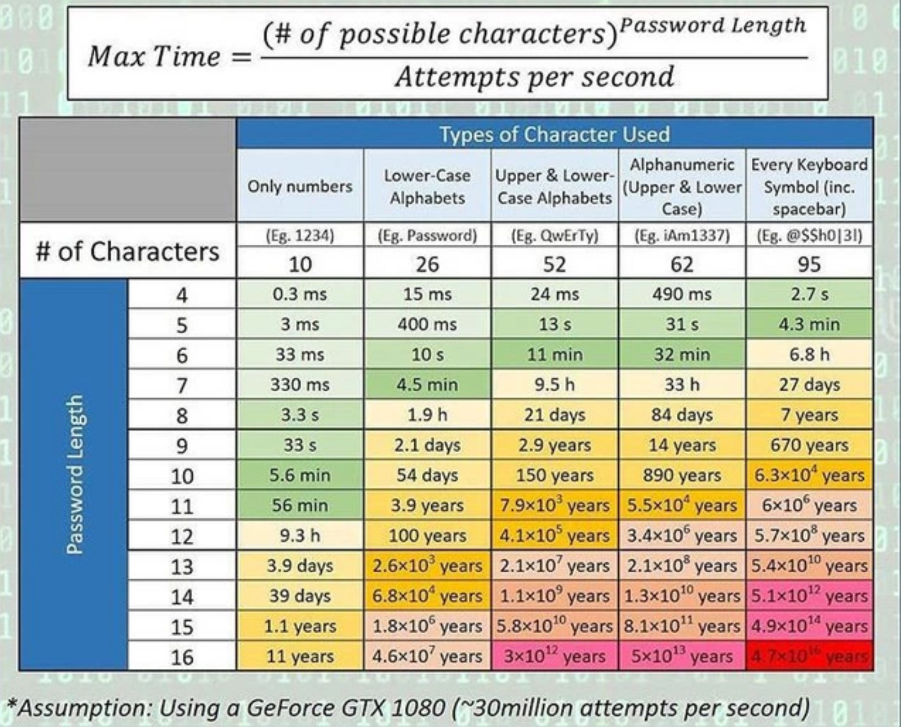

github-zipcrack-action
======================
`ZipCrack.exe` is from [henriksb/ZipCrack: Crack password protected zip files](https://github.com/henriksb/ZipCrack)

### How to use
- `.\ZipCrack.exe "xxx.zip" abcdefghijklmnopqrstuvwxyzABCDEFGHIJKLMNOPQRSTUVWXUYZ0123456789 bruteforce`

### TODOs
- [ ] distributed version
  - gpu (c++ cuda)
  - push combination chucks and / or different length per worker
